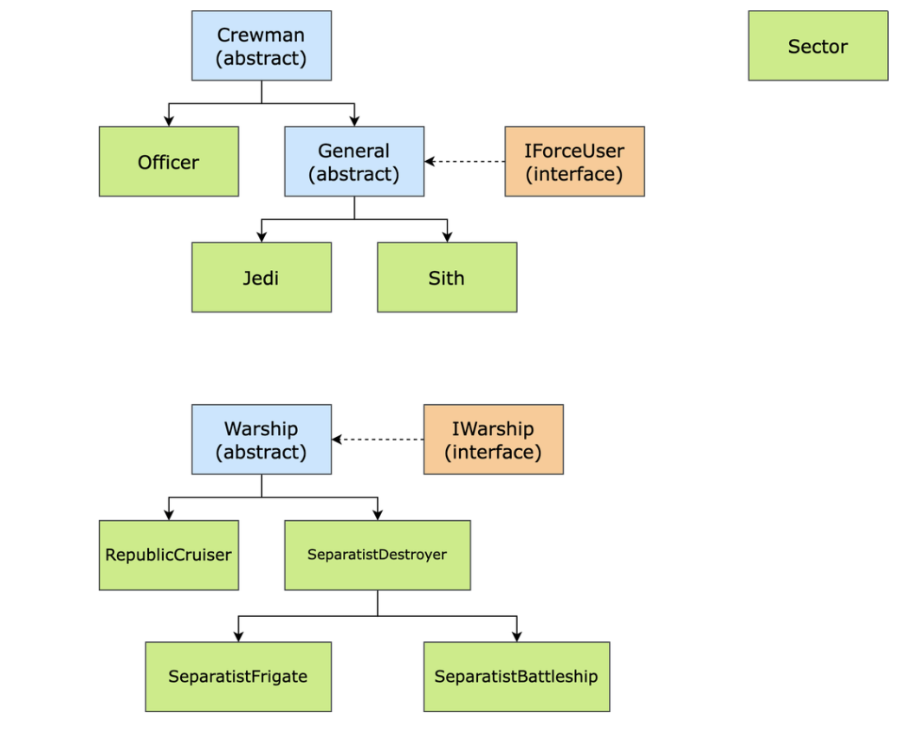

# Star-Wars-OOP-project

This is a project for the Object Oriented Programming course at CMPE160-Spring 2022, Bogazici University.
This project includes the comprehensive use of OOP concepts such as inheritance, polymorphism, encapsulation, abstraction, etc. in Java.
All the details of the project can be found in the project_description.pdf file.

## FlowChart of the Star Wars Universe

